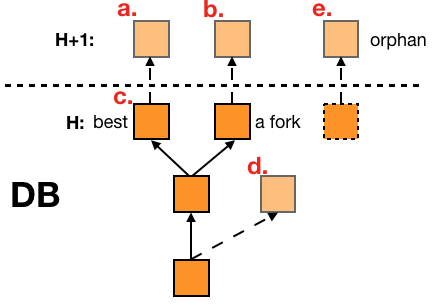

# 比特币轻客户端

​	SpvClient是跨链生态中每个联盟链节点对比特币跨链交易进行验证、投票和签名的工具，包含了比特币轻客户端的功能，维护了区块头数据。

## 使用

在项目根目录下运行以下命令即可

```go
go build ./cmd/run.go
```

## 架构

​	整个项目可以大体分为三部分：比特币网络交互、区块头数据维护和联盟链交互。网络交互部分实现了轻客户端和比特币网络之间的交互逻辑，包含节点的维护、消息的处理，能直接向区块头数据库提交数据，并处理分叉等常见问题；区块头数据库维护了所有区块头数据，维护了最长链，包括所有分叉链，通过BoltDB实现；联盟链交互部分实现了对BTC跨链交易的投票和签名。


### 联盟链交互

​	联盟链交互服务，即上图中的Allia Serv部分，需要实现联盟链共识节点验证BTC跨链交易的功能，为此需要一个自己的BTC轻客户端，来验证区块头中的merkle root和交易proof的是否相等，经过检验后，Voter调用联盟链合约对该BTC跨链交易投票。

​	在联盟链的多签钱包需要出金，也就是跨链锁定的BTC要返回比特币网络的时候，Allia Serv会监听联盟链，收到经过验证且未签名的BTC多签出金交易，节点用自己的私钥签名后，将自己的签名通过调用智能合约落账到联盟链中，在联盟链的共识中组合成完整的交易，并被Relayer广播出去。

### 比特币交互

 	比特币交互服务，即图中的Net Serv部分，实现了与比特币网络交互的具体逻辑。

​	Peers维护了比特币网络中的节点，包括他们的当前高度等状态，轻客户端会向他们发送各种消息，比如GetHeaders等，用于请求区块头、获取更多节点地址等。

​	Handler实现了比特币消息处理的具体逻辑，包含Inventory、headers的处理等，主要分为两个阶段：主动同步和被动同步，单节点同步指的是当本地数据库区块头时间比较久远或者其他节点具备更高的高度时，会先选择一个最优的同步节点，我们仅向这个节点请求区块头，等到我们同步到与其相同的高度后，进入被动同步，也就是接收Peers中所有节点的区块头。上面过程中接受的区块头都提交到数据库中，这期间处理了分叉等问题。

### 区块头数据库

​	区块头数据库主要维护了所有合法的区块头、最长链指针和已投过票的BTC交易，数据库中维护了所有分叉的数据，通过最长链指针指向最长链的区块头。

​	下面介绍一下轻客户端对于区块头存储的具体策略。接收到的区块头大概可以分为五种情形，如下a-e，当然区块首先是合法的。



- **a.**：这是正常情况，DB中的best是指向最长链的指针，新的区块头是best的下一个合法区块，存储a并更新best。

- **b.**：当收到一个合法且高度大于best的区块头时，先排除a的情况，然后再DB中找到其父亲区块头，即一个分叉链，因为这个新的b区块头高于我们的best，所以将b区块头存储下来，并更新b为最新的best。

- **c.**：新来的区块头是重复的。

- d.：新提交的区块头是某个分叉的下一个区块头，只要它的父亲区块头在数据库中，那么就接收并存储它。

- e.：e区块头的父亲区块头不在DB中，所以e是孤儿区块，只有在被动同步的时候，才会处理孤儿区块，因为它所在的分叉可能是最长链，或者存在成为最长链的潜力，所以需要以提交e的节点为主节点进入主动同步，获取其分叉的其余区块。

  

